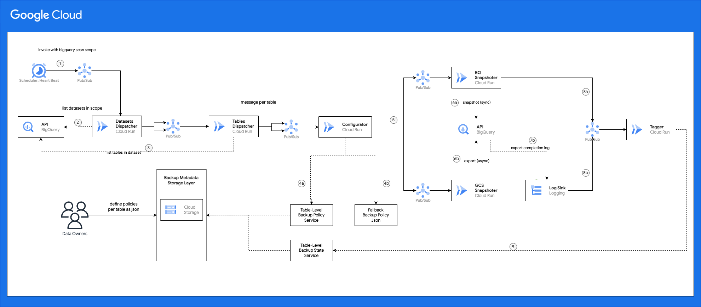

# BigQuery Backup Manager

## Table Of Contents
<!-- TOC -->
* [BigQuery Backup Manager](#bigquery-backup-manager)
  * [Table Of Contents](#table-of-contents)
  * [Overview](#overview)
  * [Architecture](#architecture)
    * [Backup Policies](#backup-policies)
    * [Components](#components)
      * [Scheduler](#scheduler)
      * [Dispatcher](#dispatcher)
      * [Configurator](#configurator)
      * [BigQuery Snapshoter](#bigquery-snapshoter)
      * [GCS Snapshoter](#gcs-snapshoter)
      * [Tagger](#tagger)
      * [Design Notes](#design-notes)
    * [Assumptions](#assumptions)
  * [Deployment](#deployment)
    * [Install Maven](#install-maven)
    * [Setup Environment Variables](#setup-environment-variables)
    * [One-time Environment Setup](#one-time-environment-setup)
      * [Enable GCP APIs](#enable-gcp-apis)
      * [Prepare Terraform State Bucket](#prepare-terraform-state-bucket)
      * [Prepare Terraform Service Account](#prepare-terraform-service-account)
      * [Prepare a Docker Repo](#prepare-a-docker-repo)
    * [Solution Deployment](#solution-deployment)
      * [gcloud](#gcloud)
      * [Build Cloud Run Services Images](#build-cloud-run-services-images)
      * [Terraform Variables Configuration](#terraform-variables-configuration)
        * [Create a Terraform .tfvars file](#create-a-terraform-tfvars-file)
        * [Configure Project Variables](#configure-project-variables)
        * [Configure Cloud Scheduler Service Account](#configure-cloud-scheduler-service-account)
        * [Configure Terraform Service Account](#configure-terraform-service-account)
        * [Configure Cloud Run Service Images](#configure-cloud-run-service-images)
        * [Configure Scheduler(s)](#configure-scheduler--s-)
        * [Fallback Policies](#fallback-policies)
        * [Fallback Policy Structure](#fallback-policy-structure)
        * [Required Policy Fields](#required-policy-fields)
        * [BigQuery Snapshot Policy Fields](#bigquery-snapshot-policy-fields)
        * [GCS Snapshot Policy Fields](#gcs-snapshot-policy-fields)
      * [Terraform Deployment](#terraform-deployment)
      * [Manual Deployment](#manual-deployment)
      * [Setup Access to Sources and Destinations](#setup-access-to-sources-and-destinations)
        * [Set Environment Variables](#set-environment-variables)
        * [Prepare Source Folders](#prepare-source-folders)
        * [Prepare Source and Destination Projects](#prepare-source-and-destination-projects)
        * [Target tables with policy tags](#target-tables-with-policy-tags)
  * [Running the Solution](#running-the-solution)
    * [Setting table-level backup policies](#setting-table-level-backup-policies)
      * [From Terminal](#from-terminal)
      * [From UI](#from-ui)
    * [Triggering backup operations](#triggering-backup-operations)
    * [Monitoring and Reporting](#monitoring-and-reporting)
  * [Limits](#limits)
<!-- TOC -->


## Overview

BigQuery Backup Manager is an open-source solution that enables BigQuery customers defining
a flexible backup strategy to all of their BigQuery folders, projects, datasets and tables
while automating the recurrent backup operations at scale. The solution offers
two backup methods for each table: [BigQuery snapshots](https://cloud.google.com/bigquery/docs/table-snapshots-intro)
and [BigQuery exports to Cloud Storage](https://cloud.google.com/bigquery/docs/exporting-data)

## Architecture



### Backup Policies
There are two ways to define backup policies for tables, and they can be used together:
* Data Owner Configuration (decentralized). Referred to as "Manual" backup policies
  * Defined on table level by the data owner via a JSON file stored in a common bucket.
* Organization Default Configuration (centralized). Referred to as "Fallback" backup policies
  * Centrally defined JSON as part of the solution (i.e. in Terraform)
  * It offers default backup strategies on folder, project, dataset and table levels
  * Only used when there are no “Data Owner Backup Configuration” attached to a table by the owning team

### Components

#### Scheduler
A cloud scheduler is used to send a BigQuery “Scan Scope” to the dispatcher service every x hours. Note that at each run all tables in scope will be checked if they should be backed up or not at this point based on their backup policy's CRON configuration

#### Dispatcher
* Generates a unique run-id for this run including a timestamp
* Uses the BigQuery API to list down all table in-scope based on the inclusion and exclusion lists passed to it
* Creates a unique tracking_id per table in the form of run_id + “_” + UUID
* Creates and publishes one request per table to the next service via PubSub.

#### Configurator
* Fetch configuration
  * Checks if the target table has a “Backup Policy” defined for it with config_source = ‘manual’ or not
    * If TRUE
      * Retrieves the cron_expression, last_backup_at fields and backup configurations (GCS and/or BQ Snapshot)
    * If FALSE
      * Retrieves the cron_expression and backup configurations from the most granular Fallback Policy (Table > dataset > project > folder)
      * Check if the table has a “Backup Policy” with config_source = ‘system’ attached. If so, retrieves the last_backup_at fields or null (first time backup)

* Filter
  * If the last_backup_at == null
    * This means the table has not been backed up before and a back is due. Proceed with a backup request. Note that the first backup will not be at the cron time because of technical/design limitations. However, subsequent backups will follow the cron.
  * Else, compares the current run time (inferred from the run_id) to the next date based on the cron_expression and the last_backup_at fields
    ```
    CronExpression cron = CronExpression.parse( ..cron.. ); 
    LocalDateTime nextRun = cron.next(..last_backup_at..); 
    LocalDateTime runTime = LocalDateTime.of(..from run_id..);
 
    If (nextRun <= runTime) 
    // Apply Backup 
    Else
    // Skip
    ```

* Dispatch Backup Request
  * Based on the Filter step output the service will decide on which backup method should be used, build a backup request using the backup configurations from step 1 and send it to the GCS Backup service or the BQ snapshot service (or both)

#### BigQuery Snapshoter
* Calls the BigQuery API to execute a snapshot operation given the snapshot config passed from the previous service
* Waits for the operation to report results, if the return status is success it sends a tagging request to the Tagger service
* Snapshot jobs finishes almost instantaneously regardless of table size, so there are no benefits in async calls.

#### GCS Snapshoter
* Calls the BigQuery API to execute a full table export to GCS given the snapshot config passed from the previous service
* Export jobs could take few minutes depending on the table size. Thus, the export job is submitted asynchronously
* Stage a tagging request to a persistent storage (i.e. Cloud Storage) and terminate the HTTP call
* When the export job completes, BigQuery will log an event to Cloud Logging that is captured by a Log Sink and sent to the Tagger service

#### Tagger
* If the request originates from the BigQuery Snapshoter, the tagger request is parsed from the PubSub message itself.
* If the request originates from the GCS Snapshoter, the tagger request is parsed from the staging persistent storage.
* If the table has a “Backup Policy” it updates the `last_backup_at`, `last_bq_snapshot_storage_uri` and `last_gcs_snapshot_storage_uri`
* If the table doesn't have a "Backup Policy" it creates a new one with config_source = ‘SYSTEM’ and sets all the backup policy fields based on the fallback policy used

### Design Notes
The solution uses multiple steps, as explained above, to list, backup and tag tables. These steps are designed so that each one
of them is responsible for doing one main task and allow for checkpointing to handle retries in a cost-efficient way, and using
PubSub to decouple these steps from each other. For example, if a table is backed up in a single run, via the Snpashoter step,
and then the Tagger step fails to update its backup policy (i.e. last_update_at field)
due to temporarily GCP API quotas/limits with the underlying service, the request will not be acknowledged to PubSub, and  
it will be retried again with exponential backoff. In this case only the tagging logic will be retried and not the entire backup operation
that was already successful.

These steps are implemented in separate Cloud Run services, vs one service with multiple endpoints, to allow fine grain control
on the concurrency, CPU, Memory and timeout settings for each step. This is especially useful since each step could use
different settings depending on its traffic pattern and processing requirements. For example:
* The Dispatcher executes once per run while the other services executes once per table; meaning they could use different concurrency settings (i.e. number of container, requests per container).
  Another
* The Dispatcher uses relatively higher memory since it's listing all tables in the scan scope which could be in thousands
* The Dispatcher and GCS Snapshoter needs relatively longer time to finish compared to the BQ Snapshoter. They could use different timeout settings
  to avoid un-wanted retries by PubSub
* Individual concurrency settings could be used to mitigate exceeding an underlying API limit and reduce retries (e.g. number of container * requests per container < api limit)

### Assumptions
* Infrastructure resources such as backup projects, datasets and buckets are created outside the solution. This should be owned by the data teams and included in proper IaaC modules with CICD with the required access permissions and configuration (e.g. expiration, object lifecycle, etc).


## Deployment

### Install Maven
* Download [Maven](https://maven.apache.org/download.cgi)
* Add Maven to PATH
```shell
export PATH=/DOWNLOADED_MAVEN_DIR/bin:$PATH
```
### Setup Environment Variables

In a terminal shell, set and export the following variables.

```shell
export PROJECT_ID=<host project id>
export TF_SA=bq-backup-mgr-terraform
export COMPUTE_REGION=<region to deploy compute resources>
export DATA_REGION=<region to deploy data resources>
export BUCKET_NAME=${PROJECT_ID}-bq-backup-mgr
export BUCKET=gs://${BUCKET_NAME}
export DOCKER_REPO_NAME=docker-repo
export CONFIG=bq-backup-manager
export ACCOUNT=<user account email>

gcloud config configurations create $CONFIG
gcloud config set project $PROJECT_ID
gcloud config set account $ACCOUNT
gcloud config set compute/region $COMPUTE_REGION

gcloud auth login
gcloud auth application-default login
```

### One-time Environment Setup

Follow the below steps to create one-time resources.
One can skip this section when re-deploying the solution (e.g. after new commits)

#### Enable GCP APIs

```shell
./scripts/enable_gcp_apis.sh
```

#### Prepare Terraform State Bucket

```shell
gsutil mb -p $PROJECT_ID -l $COMPUTE_REGION -b on $BUCKET
```

#### Prepare Terraform Service Account

Create a service account with required permissions to be used by Terraform

```shell
./scripts/prepare_terraform_service_account.sh
```

#### Prepare a Docker Repo

We need a Docker Repository to publish images that are used by this solution

```shell
gcloud artifacts repositories create $DOCKER_REPO_NAME --repository-format=docker \
--location=$COMPUTE_REGION --description="Docker repository for BQ Backup Manager"
```

### Solution Deployment

Make sure that the previous deployment steps have run at least once,
then follow the below steps to (re)deploy the latest codebase to the GCP environment.

#### gcloud
Activate the desired gcloud configuration and authenticate
```shell
gcloud config configurations activate $CONFIG

gcloud auth login
gcloud auth application-default login 
```
#### Build Cloud Run Services Images

We need to build and deploy docker images to be used by the Cloud Run service.

```shell
export DISPATCHER_IMAGE=${COMPUTE_REGION}-docker.pkg.dev/${PROJECT_ID}/${DOCKER_REPO_NAME}/bqsm-dispatcher-service:latest
export CONFIGURATOR_IMAGE=${COMPUTE_REGION}-docker.pkg.dev/${PROJECT_ID}/${DOCKER_REPO_NAME}/bqsm-configurator-service:latest
export SNAPSHOTER_BQ_IMAGE=${COMPUTE_REGION}-docker.pkg.dev/${PROJECT_ID}/${DOCKER_REPO_NAME}/bqsm-snapshoter-bq-service:latest
export SNAPSHOTER_GCS_IMAGE=${COMPUTE_REGION}-docker.pkg.dev/${PROJECT_ID}/${DOCKER_REPO_NAME}/bqsm-snapshoter-gcs-service:latest
export TAGGER_IMAGE=${COMPUTE_REGION}-docker.pkg.dev/${PROJECT_ID}/${DOCKER_REPO_NAME}/bqsm-tagger-service:latest

./scripts/deploy_services.sh
```

#### Terraform Variables Configuration

The solution is deployed by Terraform and thus all configurations are done
on the Terraform side.

##### Create a Terraform .tfvars file

Create a new .tfvars file and override the variables in the below sections. You can use the example
tfavrs files as a base [example-variables](terraform/example-variables.text).

```shell
export VARS=my-variables.tfvars
```

##### Configure Project Variables

Most required variables have default values defined in [variables.tf](terraform/variables.tf).
One can use the defaults or overwrite them in the newly created .tfvars.

Both ways, one must set the below variables:

```yaml
project = "<GCP project ID to deploy solution to (equals to $PROJECT_ID) >"
compute_region = "<GCP region to deploy compute resources e.g. cloud run, iam, etc (equals to $COMPUTE_REGION)>"
data_region = "<GCP region to deploy data resources (buckets, datasets, etc> (equals to $DATA_REGION)"
```

##### Configure Terraform Service Account

Terraform will use a service account to deploy resources.

This service account name is defined in the "Setup Environment Variables" step and created
in the "Prepare Terraform Service Account" step.
Use the full email of the created account.
```yaml
terraform_service_account = "bq-backup-mgr-terraform@<host project>.iam.gserviceaccount.com"
```

##### Configure Cloud Run Service Images

Earlier, we used Docker to build container images that will be used by the solution.
In this step, we instruct Terraform to use these published images in the Cloud Run services
that Terraform will create.

PS: Terraform will just "link" a Cloud Run to an existing image. It will not build the images from the code base (this
is already done in a previous step)

```yaml
dispatcher_service_image     = "< value of env variable DISPATCHER_IMAGE >"
configurator_service_image   = "< value of env variable CONFIGURATOR_IMAGE >"
snapshoter_bq_service_image  = "< value of env variable DISPATCHER_IMAGE >"
snapshoter_gcs_service_image = "< value of env variable SNAPSHOTER_GCS_IMAGE>"
tagger_service_image         = "< value of env variable TAGGER_IMAGE>"
``` 

##### Configure Scheduler(s)

Define at least one scheduler under the `schedulers` variable.  
There must be at least one scheduler acting as a heart-beat of the solution that
periodically lists tables and check if a backup is due for each of them based on their table-level backup CRON.
```yaml
  {
    name    = "heart_beat"
    cron    = "0 * * * *" # hourly
    payload = {
        is_force_run = false
        is_dry_run   = false

        folders_include_list  = []
        projects_include_list = []
        projects_exclude_list = []
        datasets_include_list = []
        datasets_exclude_list = []
        tables_include_list   = []
        tables_exclude_list   = []
}
}
```

###### Payload Fields:

| Field                   | Description                                                                                                                                                                                                                              |
|-------------------------|------------------------------------------------------------------------------------------------------------------------------------------------------------------------------------------------------------------------------------------|
| `name`                  | Display name of the Cloud Scheduler                                                                                                                                                                                                      |
| `cron`                  | A CRON expression to set the frequency in which tables in-scope are checked for whether to backup or not based on their individual backup schedule. This could be any [unix-cron](https://en.wikipedia.org/wiki/Cron) compatible string. |
| `is_force_run`          | When set to `true` all tables in scope will be backed-up regardless of their CRON setting                                                                                                                                                | 
| `is_dry_run`            | When set to `true` no actual backup operations will take place. Only log messages will be generated. This is useful for testing and debugging without incurring backup cost.                                                             | 
| `folders_include_list`  | List of folder numbers e.g. `[1234, 456]` to backup BigQuery tables under them. Setting this will ignore `projects_include_list`, `datasets_include_list` and `tables_include_list`                                                      | 
| `projects_include_list` | List of projects names e.g. `["porject1", "project2"]` to backup BigQuery tables under them. Setting this will ignore `datasets_include_list` and `tables_include_list`. This has no effect if `folders_include_list` is set.            | 
| `projects_exclude_list` | List of projects names or regex e.g. `["project1", "regex:^test_"]` to NOT take backups of their BigQuery tables. This field could be used in combination with `folders_include_list`                                                    | 
| `datasets_include_list` | List of datasets e.g. `["porject1.dataset1", "project1.dataset2"]` to backup BigQuery tables under them. Setting this will ignore `tables_include_list`. This has no effect if `folders_include_list` or `projects_include_list` is set. | 
| `datasets_exclude_list` | List of datasets or regex e.g. `["porject1.dataset1", "regex:.*\\_landing$"]` to NOT take backups of their BigQuery tables. This field could be used in combination with `folders_include_list` or `projects_include_list`               | 
| `tables_include_list`   | List of tables e.g. `["porject1.dataset1.table1", "project1.dataset2.table2"]` to backup. This has no effect if `folders_include_list`, `projects_include_list` or `datasets_include_list` is set.                                       | 
| `tables_exclude_list`   | List of tables or regex e.g. `["porject1.dataset1.table1", "regex:.*\_test"]` to NOT take backups for. This field could be used in combination with `folders_include_list`, `projects_include_list` or `datasets_include_list`           | 

###### Using regular expressions in exclusion lists:
All exclusion lists accept regular expressions in the form "regex:<regular expression>".
If the fully qualified entry name (e.g. project.dataset.table) matches any of the supplied regex, it will be excluded from the backup scope.
Some common use cases would be:
* Excluding all "<xyz>_landing" datasets: `datasets_exclude_list = ["regex:.*\\_landing$"]`
* Excluding all tables ending with _test, _tst, _bkp or _copy: `tables_exclude_list = ["regex:.*\_(test|tst|bkp|copy)"]`


##### Fallback Policies

On each run the solution needs to determine the backup policy of each in-scope table.
This could be a [manually attached policy to a table](#Setting-table-level-backup-policies)
or a "Fallback Policy" for tables without attached policies.
Note that manually attached policies have precedence over fallback policies when determining the backup policy of a table

The "Fallback Policy" is defined by a `default_policy` and a set
of exceptions\overrides to that policy on different levels (folder, project, dataset and table).
This provides granular flexibility without creating an entry for each single table.

##### Fallback Policy Structure

```yaml
fallback_policy = {
"default_policy" : {..Policy Fields..},
"folder_overrides" : {
  "<folder1 number>" : {..Policy Fields..},
  "<folder2 number>" : {..Policy Fields..},
                       ..etc
},
"project_overrides" : {
  "<project1 name>" : {..Policy Fields..},
  "<project2 name>" : {..Policy Fields..},
                        ..etc
},
"dataset_overrides" : {
  "<project name>.<dataset1 name>" : {..Policy Fields..},
  "<project name>.<dataset2 name>" : {..Policy Fields..}
                                       ..etc
},
"table_overrides" : {
  "<project name>.<dataset name>.<table1 name>" : {..Policy Fields..},
  "<project name>.<dataset name>.<table2 name>" : {..Policy Fields..},
                      etc
}
```

PS: If no overrides are set on a certain level, set that level to an empty map (e.g. `project_overrides : {}`  ).

There are different sets of policy fields depending on the backup method:

##### Common Policy Fields

| Field                            | Required | Description                                                                                                                                                                                                                                                     |
|----------------------------------|----------|-----------------------------------------------------------------------------------------------------------------------------------------------------------------------------------------------------------------------------------------------------------------|
| `backup_cron`                    | True     | A CRON expression to set the frequency in which a table is backed up. This must be a [Spring-Framwork compatible](https://docs.spring.io/spring-framework/docs/current/javadoc-api/org/springframework/scheduling/support/CronExpression.html) CRON expression. |
| `backup_method`                  | True     | One method from `BigQuery Snapshot`, `GCS Snapshot` or `Both`. One must then provide the required fields for each chosen backup method as shown below.                                                                                                          |
| `backup_time_travel_offset_days` | True     | A `string` value with the number of days that determines a previous point of time to backup the table from. Values allowed are `0` to `7`.                                                                                                                      | 
| `backup_storage_project`         | True     | Project ID on which all snapshot and export operations are stored. This is the project where the bq_snapshot_storage_dataset and/or gcs_snapshot_storage_location resides.                                                                                      |
| `backup_operation_project`       | False    | Project ID on which all snapshot and export operations will run. Snapshot and Export job quotas and limits will be against this project. This could be the same value as backup_storage_project. If not set, the source table project will be used.             |                                                                                                                                                                                        

##### BigQuery Snapshot Policy Fields

One must set the below fields when choosing the `BigQuery Snapshot` or `Both` backup_method:

| Field                   | Description                                                                                           |
|-------------------------|-------------------------------------------------------------------------------------------------------|
| `bq_snapshot_storage_dataset`                  | A dataset name to store snapshots to. The dataset must already exist in the `backup_storage_project`. |
| `bq_snapshot_expiration_days`                  | A `string` value representing the number of days to keep each snapshot.                               |

##### GCS Snapshot Policy Fields

One must set the below fields when choosing the `GCS Snapshot` or `Both` backup method:


| Field                   | Description                                                                                  |
|-------------------------|----------------------------------------------------------------------------------------------|
| `gcs_snapshot_storage_location` | A GCS bucket in the format `gs://bucket/path/` to store snapshots to.                        |
| `gcs_snapshot_format`           | The file format and compression used to export a BigQuery table to GCS. Avaiable values are `CSV`, `CSV_GZIP`, `JSON`, `JSON_GZIP`, `AVRO`, `AVRO_DEFLATE`, `AVRO_SNAPPY`, `PARQUET`, `PARQUET_SNAPPY`, `PARQUET_GZIP` |
| `gcs_avro_use_logical_types`    | When set to `FALSE` the below BigQuery types are exported as strings, otherwise as their corresponding [Avro logical type](https://avro.apache.org/docs/1.10.2/spec.html#Logical+Types).    | 

BigQuery Types to Avro Logical Types mapping:

| BigQuery Type | Avro Logical Type                               |
|------------|-------------------------------------------------|
| `TIMESTAMP` | `timestamp-micros` (annotates Avro `LONG`)      |
| `DATE`     | `date` (annotates Avro `INT`)                   |
| `TIME`     | `timestamp-micro` (annotates Avro `LONG`)       | 
| `DATETIME` | `STRING` (custom named logical type `datetime`) | 

##### Configure Backup Projects

###### Additional Backup Operation Projects

Terraform needs to deploy resources to the backup projects where the backup operations will run. For example, log
sinks that send notifications to the Tagger once a backup operation has completed.

By default, all projects listed in the `backup_operation_project` field in the fallback policy will be automatically included.
However, for additional backup projects such as the ones defined in external configuration (i.e. table backup policy tags),
or if you want to use the default source tables projects, one must add them to the below list.

```
additional_backup_operation_projects = ["project1", "project2", ..]
```

If you're only using the fallback backup policy and without table-level external policies, you can set this variable to an empty list `[]`

###### Configure Terraform SA permissions on Backup Projects

In order for Terraform to deploy resources on the backup operation projects (configured in the previous step), the service account
used by Terraform must have the required permissions on these projects. To do so, run the following command:

```shell
./scripts/prepare_backup_operation_projects_for_terraform.sh <project1> <project2> <etc>
```

The list of projects must include all projects you're planning to run backup operations in. This includes the following:
* All projects listed under the`backup_operation_project` field in the fallback policy
* Source tables projects (if you're not setting the `backup_operation_project`)
* Projects included in the `additional_backup_operation_projects` Terraform variable.

#### Terraform Deployment

```shell
cd terraform

terraform init \
    -backend-config="bucket=${BUCKET_NAME}" \
    -backend-config="prefix=terraform-state" \
    -backend-config="impersonate_service_account=$TF_SA@$PROJECT_ID.iam.gserviceaccount.com"
    
terraform plan -var-file=$VARS

terraform apply -var-file=$VARS -auto-approve

```

#### Manual Deployment

Terraform doesn't provide modules to add TTL policies for Firestore (yet). For that, run the below command:

```bash
gcloud firestore fields ttls update expires_at \
--collection-group=project_folder_cache \
--enable-ttl \
--async \
--project=$PROJECT_ID
```
The solution used Firestore in Datastore mode as a cache in some situations. The TTL policy will allow
Firestore to automatically delete entries that are expired to save cost and improve lookup performance.

#### Setup Access to Sources and Destinations

##### Set Environment Variables

Set the following variables for the service accounts used by the solution:
```shell
export SA_DISPATCHER_EMAIL=dispatcher@${PROJECT_ID}.iam.gserviceaccount.com
export SA_CONFIGURATOR_EMAIL=configurator@${PROJECT_ID}.iam.gserviceaccount.com
export SA_SNAPSHOTER_BQ_EMAIL=snapshoter-bq@${PROJECT_ID}.iam.gserviceaccount.com
export SA_SNAPSHOTER_GCS_EMAIL=snapshoter-gcs@${PROJECT_ID}.iam.gserviceaccount.com
export SA_TAGGER_EMAIL=tagger@${PROJECT_ID}.iam.gserviceaccount.com
```  
##### Prepare Source Folders

If one would like to set the BigQuery scan scope to include certain folders via the `folders_include_list`, one must grant
certain permissions on the folder level.

To do so, run the following script from the project root folder:
```shell
./scripts/prepare_data_folders.sh <folder1> <folder2> <etc>

```

##### Prepare Source and Destination Projects

To enable the application to take backup of tables in "data projects" (i.e. source projects), run backup operations on "data operation projects"
and store them under "backup storage projects" (i.e. destination projects) one must grant a number of permissions on each of these project.

To do so, run the following script from the project root folder:

```shell
./scripts/prepare_data_projects.sh <project1> <project2> <etc>

./scripts/prepare_backup_storage_projects.sh <project1> <project2> <etc>

./scripts/prepare_backup_operation_projects.sh <project1> <project2> <etc>
```

PS:
* Update the SA emails if the default names have been changed in Terraform
* If you have tables to be backed-up in the host project, run the above script and include the host project in the list
* For data projects, use the same projects listed in all the `include lists` in the Terraform variable `schedulers`
* For backup storage projects, use the same projects listed in all the `backup_storage_project` fields in the Terraform variable `fallback_policy` and in the manually attached backup tag-templates.
* For backup operation projects, use the same projects listed in:
  * All the `backup_operation_project` fields in the Terraform variable `fallback_policy`
  * Source tables projects in all inclusion lists in the BigQuery Scan scope (if you're not explicitly setting the `backup_operation_project` field)
  * The manually attached table-level backup policies
* If a project is used both as the source and destination, include the project in all scripts
* If a project is used both as the `backup_storage_project` and `backup_operation_project`, include the project in both respective scripts

##### Target tables with policy tags

For tables that use column-level access control, one must grant access to the solution's service accounts
to be able to read the table data in order to create a backup.

To do so, identify the Dataplex policy tag taxonomies used and run the following script for each of them:
```shell
TAXONOMY="projects/<taxonomy project>/locations/<taxonomy location>/taxonomies/<taxonomy id>"

gcloud data-catalog taxonomies add-iam-policy-binding \
$TAXONOMY \
--member="serviceAccount:${SA_SNAPSHOTER_BQ_EMAIL}" \
--role='roles/datacatalog.categoryFineGrainedReader'

gcloud data-catalog taxonomies add-iam-policy-binding \
$TAXONOMY \
--member="serviceAccount:${SA_SNAPSHOTER_GCS_EMAIL}" \
--role='roles/datacatalog.categoryFineGrainedReader'
```

## Running the Solution

### Setting table-level backup policies

Update the fields in the below example policy and store in the backup policies store (i.e. GCS)

```shell
# Use the default backup policies bucket unless overwritten in the .tfvars
export POLICIES_BUCKET=${PROJECT_ID}-bq-backup-manager-policies 

# set target table info
export TABLE_PROJECT=<table_project>
export TABLE_DATASET=<table_dataset>
export TABLE=<table_name>

# Config Source must be 'MANUAL' when assigned this way.
export BACKUP_POLICY="{
'config_source' : 'MANUAL',
'backup_cron' : '0 0 0 1 1 1',
'backup_method' : 'Both',
'backup_time_travel_offset_days' : '3',
'backup_storage_project' : 'backup_project_name',
'backup_operation_project' : 'backup_project_name',
'gcs_snapshot_storage_location' : 'gs://backup-bucket',
'gcs_snapshot_format' : 'AVRO_SNAPPY',
'gcs_avro_use_logical_types' : 'true',
'bq_snapshot_storage_dataset' : 'bq_backup',
'bq_snapshot_expiration_days' : '15'}"

# File name MUST BE backup_policy.json
echo $BACKUP_POLICY >> backup_policy.json

gsutil cp backup_policy.json gs://${POLICIES_BUCKET}/policy/project=${TABLE_PROJECT}/dataset=${TABLE_DATASET}/table=${TABLE}/backup_policy.json
```

### Triggering backup operations
The entry point of the solution is any of the Cloud Schedulers configured earlier. Cloud Schedulers will
automatically execute based on their CRON expression, nevertheless, one could force-run them from
GCP Console >> Cloud Scheduler >> Actions >> Force a Job Run

### Monitoring and Reporting


To get progress stats of each run (including in-progress one)
```roomsql
SELECT * FROM `bq_backup_manager.v_run_summary_counts`
```

To get all fatal (non retryable errors) for a single run
```roomsql
SELECT * FROM `bq_backup_manager.v_errors_non_retryable`
WHERE run_id = '<run id>'
```

To get all runs on a table and their execution information
```roomsql
SELECT * FROM `bq_backup_manager.v_errors_non_retryable`
WHERE tablespec = 'project.dataset.table'
```
or the `grouped` version for a better UI experience
```roomsql
SELECT * FROM `bq_backup_manager.v_audit_log_by_table_grouped`, UNNEST(runs) r
WHERE r.run_has_retryable_error = FALSE
```

To get detailed request and response for each service invocation (i.e. for debugging)
```roomsql
SELECT
jsonPayload.unified_target_table AS tablespec,
jsonPayload.unified_run_id AS run_id,
jsonPayload.unified_tracking_id AS tracking_id,
CAST(jsonPayload.unified_is_successful AS BOOL) AS configurator_is_successful,
jsonPayload.unified_error AS configurator_error,
CAST(jsonPayload.unified_is_retryable_error AS BOOL) AS configurator_is_retryable_error,
CAST(JSON_VALUE(jsonPayload.unified_input_json, '$.isForceRun') AS BOOL) AS is_force_run,
CAST(JSON_VALUE(jsonPayload.unified_output_json, '$.isBackupTime') AS BOOL) AS is_backup_time,
JSON_VALUE(jsonPayload.unified_output_json, '$.backupPolicy.method') AS backup_method,
CAST(JSON_VALUE(jsonPayload.unified_input_json, '$.isDryRun') AS BOOL) AS is_dry_run,
jsonPayload.unified_input_json AS request_json,
jsonPayload.unified_output_json AS response_json
FROM `bq_backup_manager.run_googleapis_com_stdout`
WHERE jsonPayload.global_app_log = 'UNIFIED_LOG'
-- 1= dispatcher, 2= configurator, 3=bq snapshoter, -3=gcs snapshoter and 4=tagger
AND jsonPayload.unified_component = "2"
```

To get the backup policies that are manually added or assigned by the system based on fallbacks
```roomsql
SELECT * FROM `bq_backup_manager.ext_backup_policies`
```


## Limits
* Each `backup_operation_project` can run up to 50,000 table snapshot jobs per day.
* Each `backup_operation_project` can run 100,000 export jobs per day (e.g. to GCS). Could be extended by slot reservation.
* Each `backup_operation_project` can export 50 TB per day for free using the shared slots pool (e.g. to GCS). Could be extended by slot reservation.
